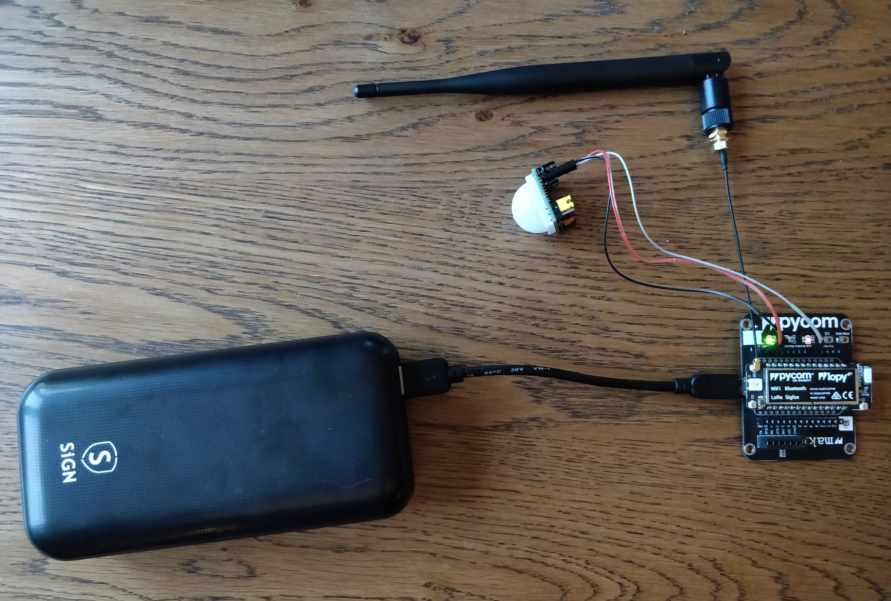

# Grillplatsify
## Gruppmedlemmar
    Isak Karlsson  
    Christoffer Eid  
    Olof Enström

## Länkar
[Hemsida](http://51.75.72.157:1880/uibuilder/)  
[Redovisningsvideo](https://www.youtube.com/watch?v=DyxquM1nRa0)  
[hardware.md](doc/hardware.md)  
[requirements.md](doc/requirements.md)  
[setup.md](doc/setup.md)  
[test.md](doc/test.md)  
[timelog.md](doc/timelog.md)

## Inledning
Vårt projekt är att skapa en hemsida som visar tillgängligheten för grillplatser runt om i städer. 

För att lyckas med det krävs övervakning på grillplatserna. Det vill säga en enhet med rörelsesensor, samt internetuppkoppling. Enheterna kommunicerar med en server som i sin tur kommunicerar med en hemsida.

## Bakgrund och idé
[SVT-artikel: Stor efterfrågan på bokningsbara grillplatser: ”Otroligt tryck”](https://www.svt.se/nyheter/lokalt/skane/stor-efterfragan-pa-bokningsbara-grillplatser)

[SVT-artikel: Rusning till friluftsområden när vi ska undvika smitta](https://www.svt.se/nyheter/lokalt/smaland/trangt-pa-friluftsomraden-nar-vi-ska-undvika-smitta)

På nyheterna ser vi ofta att grillplatser runt om i landet är överfulla. De skriver att trycket är otroligt, att rusningen till grillplatsen ökar i takt med pandemin, och att lösningar måste hittas. 

Människor gillar att grilla men hatar att vänta. Ofta när man beger sig ut för att grilla med sina kompisar händer det att man kånkat på mycket packning, så som, mat, ved, tändvätska. När man väl kommer fram till grillplatsen ser man att den är upptagen. Inte alltid bara upptagen utan ibland till och med kö. Det är nog för att göra en bra dag till en dålig dag. Man får gå tillbaka till bilen, och köra vidare till nästa grillplats med hoppet om att nästa grillplats är ledig. 

Vi kom på idén om att en hemsida där man såg tillgängligheten på olika grillplatser runt om i landet borde finnas, men gör det inte. Så vi tog på oss ansvaret att skapa en. 

Med en grillplatshemsida kan man smidigt och enkelt hemma i värmen klicka sig in på hemsidan, kolla vilken grillplats som är ledig i sin närhet, och åka till sin lokala grillplats med en trygghet backad av vetskapen om att grillplatsen man kommer anlända till är tillgänglig. 

## Metod

### Pycom-enheten
För att kunna mäta aktiveten vid en grillplats kom vi fram till en lösning där vi använder oss av en [Pycom Expansionboard](doc/hardware.md) med en [LoPy4](doc/hardware.md)-enkortsdator. Till Pycom-enheten kopplar vi en [PIR-sensor](doc/hardware.md) (rörelsesensor) som känner av förändring av infraröd strålning och ger en output på `high` eller `low` beroende på om förändringen är stor eller liten. För att kunna skicka vidare data från pycom-enheten till vår server och databas använder vi `LoRa` och behöver då en [LoRa-antenn](doc/hardware.md#lora-antenn). `LoRa` är en dataöverföringsteknik som står för "Long Range" och är bra för att skicka små mängder data över långa sträckor. Eftersom enheten ska vara ute i naturen använder vi en [powerbank](doc/hardware.md) till strömförsörjningen och placerar allt i en [kopplingsdosa](doc/hardware.md) för att skydda mot väder, vind och vatten. 

`Pycomen`, `PIR-sensorn`, `LoRa-antennen` och `powerbanken` är kopplade som nedan:

Och när de placeras ute på plats i `kopplingsdosan` ser det ut såhär:

Med koden på `Pycomen` försöker vi ha i `deepsleep` så mycket som möjligt för att den ska dra mindre ström och därmed kommer batteriet hålla längre. För att "väcka" enheten använder vi oss av `PIR-sensorn`, om dess output ändras från `high` till `low` eller `low` till `high` kommer enheten att väckas och koden startar. Då börjar vi leta efter WiFi-enheter samtidigt som den kopplar upp sig mot `LoRa`. Om koden väcks av att `PIR-sensorns` output ändras till `low` betyder det att det inte förekommit någon rörelse på platsen under de senaste 5 minuterna och då skickar vi en nolla (som betyder att platsen är ledig) med `LoRa` till `TTN`. Om den istället väcks av att outputen ändras till `high` betyder det att det nu förekommer rörelse på platsen. Om den även hittar WiFi-enheter betyder det att det är människor där och att grillplatsen är upptagen, då skickar vi en etta till `TTN`. Om den däremot inte hittar någon WiFi-enhet betyder det förmodligen att inga människor är på platsen och då skickar vi en tvåa. 

### Hemsida
Vi ville på ett snyggt och lättförståeligt sätt visa grillplatsernas status på en karta. Det skulle också vara en “live-koppling” mellan kartan och servern så att användarna alltid fick den senaste statusen utan att behöva uppdatera sidan.

För att åstadkomma detta använde vi Node-RED och InfluxDB som körs i Docker. Pluginen för InfluxDB och uibuilder används också i Node-RED. Med docker-compose kan vi sedan starta upp både Node-RED och InfluxDB samtidigt utifrån config-filen docker-compose.yml, som i sin tur skapar en image för Node-RED från Dockerfile.

Med Node-RED bygger vi sedan logik och koppling mellan TTN, InfluxDB och uibuilder med hjälp av noder. Datan som skickas från våra enheter tas nu emot i noden för TTN, sedan formateras datan för att läggas in direkt i databasen och så skickas den till hemsidan. Skulle servern startas om eller uppdateras så hämtas de senaste värdena som skickas till hemsidan.

Front-enden är byggd med `uibuilder` som använder `socket.io` för att skicka information i realtid mellan back-end och front-end. Sedan använder den också `Vue.js` för att bygga front-end. Vi lade till `leaflet.js` som är ett JavaScript-bibliotek för mobilvänliga kartor. `leaflet.js` använder i sin tur Mapbox api för att rita ut kartorna på sidan. Med dessa verktyg kunde vi bygga en karta, centrerad över Kalmar, som visar ikoner på de platser vi har valt. Ikonerna ändrar automatiskt färg mellan rött och grönt om grillplatsen är upptagen respektive ledig. Det går även att klicka på ikonerna för att få upp namnet, status och vägbeskrivning dit.

## Resultat och Diskussion
### Hemsida
Vi hade som mål med hemsidan att den skulle kunna visa tillgängligheten på diverse grillplatser runt om i kalmar. Vi ville också att man skulle kunna se statistik för de olika grillplatserna samt recensioner. 

Vi testade att använda en TIG-stack först. Det fungerade väldigt smidigt men vi kunde inte riktigt anpassa karten på det sätt vi ville för att visa grillplatsernas status. Så vi valde att skrota den idéen och gå vidare med Node-RED, InfluxDB och uibuilder istället.

Vi har lyckats riktigt bra med möjligheten att se tillgängligheten för olika grillplatser. På hemsidan visas en karta som man enkelt kan navigera sig runt bland olika grillplatser med. Grillplatsen är grön om den är ledig, och röd om den är upptagen.

Vi har inte hunnit tillgängliggöra någon form av statistik tyvärr. Vi har fixat en databas där vi sparar all data de olika enheterna skickar ut men eftersom att vi inte lyckats få någon enhet att köra mer än något dygn blir det ingen användbar statistik av datan. När eller om vi lyckas fixa buggen som stoppar våra enheter från att köras en längre period kan vi omedelbart börja visa statistik på hemsidan. 

Vi har heller inte hunnit göra recensioner tillgängliga på hemsidan. Det var ett krav som låg väldigt lågt prioriterat för oss. Så vi har helt enkelt inte ens hunnit försöka att tillämpa den funktionen. 

### Rörelsesensor
Vårt mål med rörelsesensorn var att på ett säkert sätt kunna väcka enheten när folk var vid grillplatsen. Med våra tester har vi kommit fram till att den är pålitlig fram till 5m avstånd. Vilket är helt klart godkänt på grillplatsen på Svinö som vi har testat enheten vid. Problem skulle uppstå om man vid en grillplats inte hittar lämpligt ställe att placera enheten på inom 5m-räckvidden.

### Wifi sniffer
Med wifi sniffern var målet att särskilja djur från människor. 

När enheten såg rörelse på grillplatsen, vill vi att wifi sniffern kollar om det finns wifi i närheten. Finns det wifi i närheten, har vi människor på plats. Detta fungerade väldigt bra. En uppenbar felfaktor är att alla kanske inte har wifi igång på telefonen, alternativt att de inte har med sig telefonen alls. Det ska dock krävas att hela umgänget saknar telefon med wifi igång (läs; otroligt). Under våra tester hemma, fungerar wifi sniffern felfritt, och under våra tester på grillplatsen på Svinö, fungerade den också bra av vad vi kunde se från vår The Things Network-konsol. 

Ett alternativ till wifi-sniffer hade kunnat vara Bluetooth-sniffer. Vi tror att wifi är vanligare att ha aktiverat än Bluetooth, så vi valde wifi. 
### LoRa
Målet med LoRa var att få en stabil och energisnål kopplingsmetod till vår server. Alternativ till LoRa hade kunnat vara WiFi eller telekommunikation. WiFi har sämre täckning än LoRa men bättre bandbredd. Bandbredden behövs inte då allt vi skickar är bits. Telekommunikation hade varit riktigt bra om det inte vore för driftkostnaden. 

Allt som allt blev LoRa bra. Vi fick en stabil uppkoppling, där alla meddelanden vi skickade kom fram till servern. Täckningen var extra bra utomhus. Vilket passar oss då det är var vi befinner oss. 
### Batteri
Batteritiden har varit viktig för oss. Vi tänker att om man vill få ned driftkostnaderna, är det viktigt med en lång batteritid. Desto längre en enhet kan köras utan underhåll, desto lägre driftkostnad. Vi har lyckats få åtminstone 16 dygns batteritid, vad vi kunnat räkna ut med våra tester. Vi hade kunnat få exakta svar om det var så att vi kunde komma förbi buggen som får pycomen att krascha efter något dygns drift. 16 dygns batteritid är vi dock inte nöjda med. Vi satsade på ett års batteritid men det verkar vara svårtillgängligt. Det bästa vore om man hade en kraftkälla på plats. Det skulle tillgängliggöra en oändligt lång driftlängd, och en minimal driftskostnad. 
### Pris
Vi ville komma undan så billigt som möjligt eftersom att vi vill ha våra Pycoms utplacerade på så många grillplatser som möjligt. I detta projekt arbetar vi ju med Pycoms, som är en rätt dyr enchipsdator. Hade vi gjort om projektet hade vi nog fått satsa på något som det [här](https://www.thethingsnetwork.org/labs/story/build-the-cheapest-possible-node-yourself). De har lyckats dra ned priset till ynka hundralappen. I princip en tiondel av vad vårt projekt har kostat. Säg att vi dubblar den prislappen så landar vi på 200 kr/enhet. Helt klart en godkänd budget för att få till sig intressenter. 