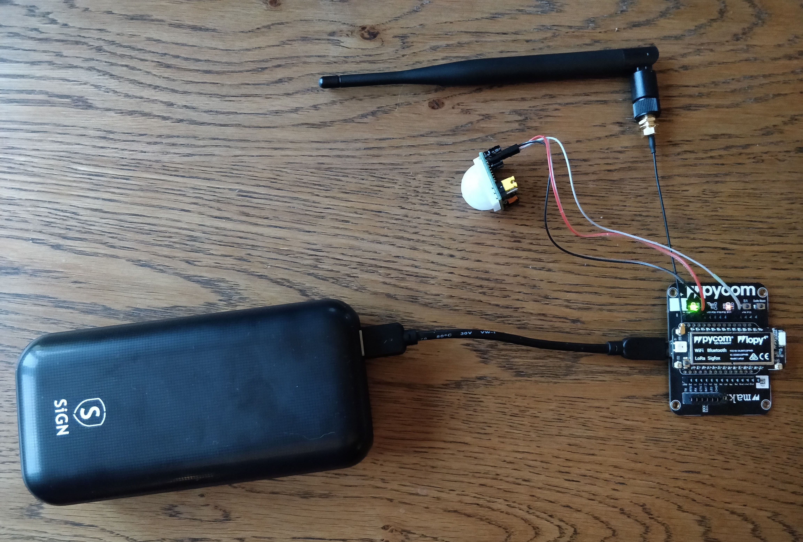
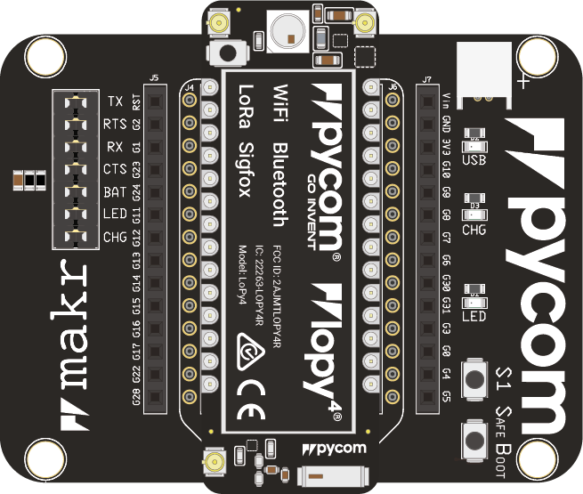
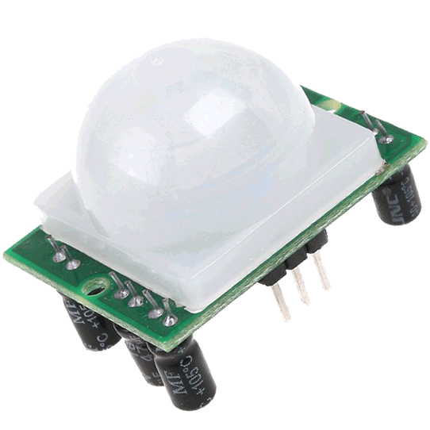
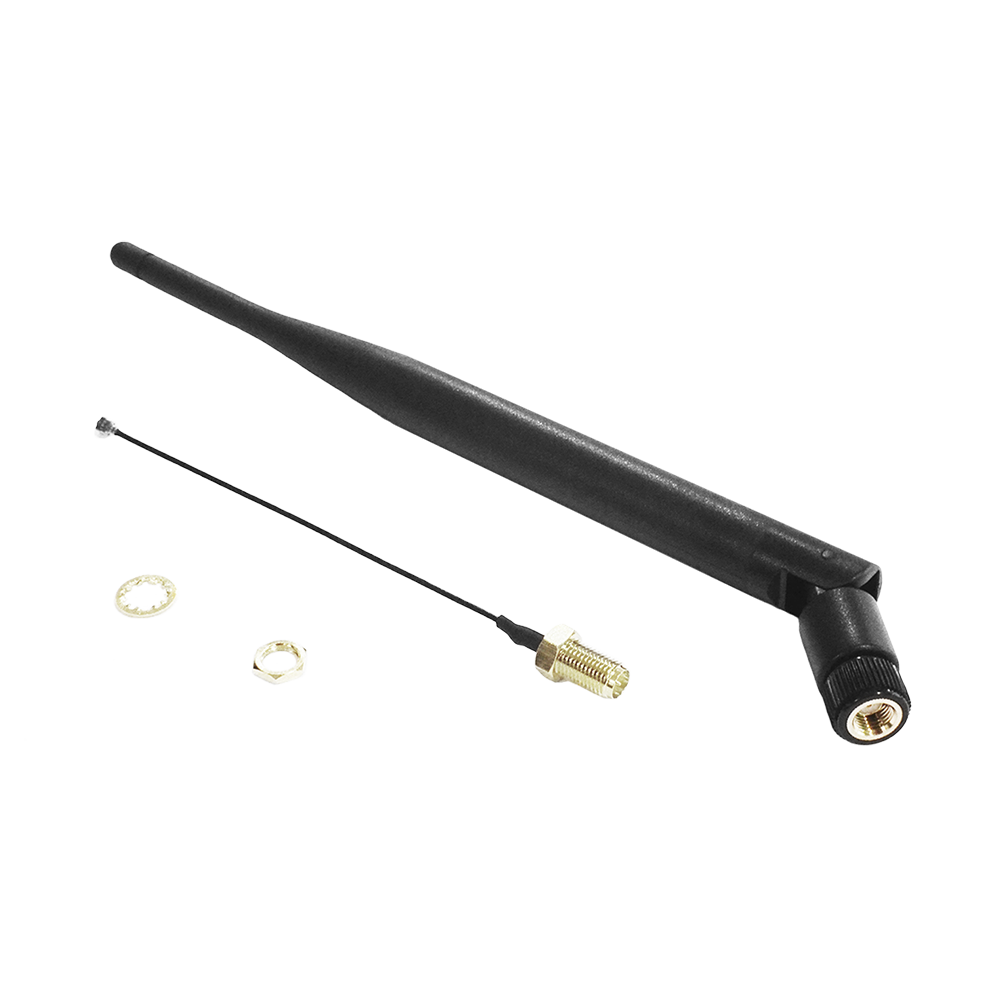
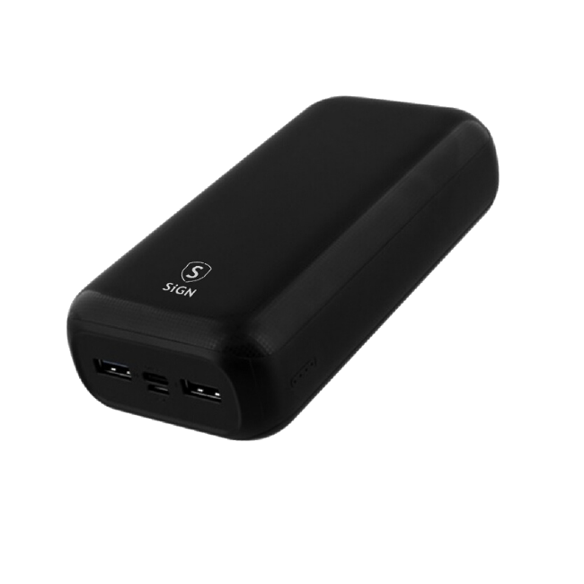
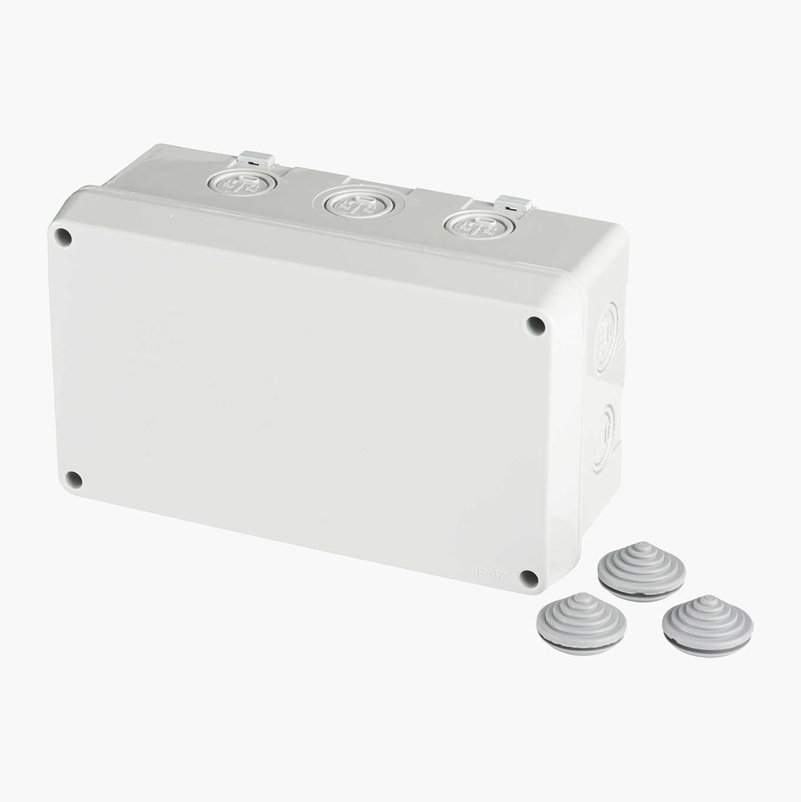
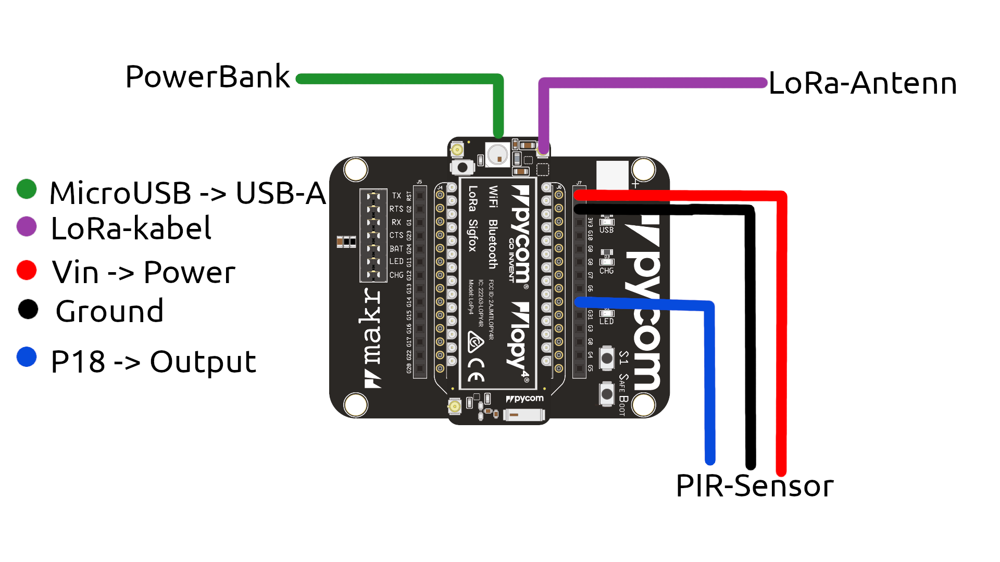

# Hårdvara

## Pycom LoPy 4 med Expansion Board. 
Pycom expansion board med en LoPy4 är en enkortsdator som vi använder för att hantera PIR-sensorns output, för att hitta WiFi-enheter och för att skicka vidare den datan vi samlat in.
### Länkar:  
[Expansionboard](https://docs.pycom.io/datasheets/expansionboards/expansion3/)  
[LoPy4 ](https://pycom.io/product/lopy4/)

## Passiv Infraröd Sensor (PIR)
En PIR-sensor känner av förändring av infraröd strålning. Den ger en output på `high` eller `low` beroende på om den känner av mycket eller lite förändring av infraröd strålning. Vad som är mycket respektive lite går att ställa in med en justeringsskruv på enheten. Känner den rörelse ger den en output på `high` under en inställd tid (i vårt fall ca 5 minuter) innan den återgår till outputen `low`. Känner sensorn rörelse under tiden som den ger outputen `high` kommer tiden förlängas och skicka `high` i den inställda tiden från den sista rörelse den känt. 
### Länk:  
[HC-SR501-PIR-sensor](https://www.banggood.com/HC-SR501-Adjustable-Infrared-IR-Pyroelectric-PIR-Module-Motion-Sensor-Human-Body-Induction-Detector-p-1545488.html?utm_source=googleshopping&utm_medium=cpc_organic&gmcCountry=SE&utm_content=minha&utm_campaign=minha-se-en-pc&currency=SEK&cur_warehouse=CN&createTmp=1&utm_source=googleshopping&utm_medium=cpc_union&utm_content=xibei&utm_campaign=xibei-ssc-se-all-0716&gclid=CjwKCAiA_9r_BRBZEiwAHZ_v19BBLBWilP8H9FNC-guw13mz1KnijFJa0o0dwiSo1fJE5oGz-OkvNxoCj44QAvD_BwE)

## LoRa-antenn
LoRa-antenn med IP-certifiering används för kommunikation mellan enheten och servern.

### Länkar
[LoRa-antenn](https://pycom.io/product/lora-868mhz-915mhz-sigfox-antenna-kit/)  
[IP67-antennkabeln](https://pycom.io/product/ip67-antenna-cable/)

## Powerbank
För strömförsörjning under långa perioder. Powerbanken kan laddas upp till 30 000 mAh.

### Länk
[Powerbank](https://www.teknikdelar.se/sign-powerbank-30.000-mah-usb-c-usb-c?dfw_tracker=35448-SNPB-30MAHB&shopping_id_click=SNPB-30MAHB&gclid=CjwKCAiA_9r_BRBZEiwAHZ_v178E5WhYa8GqgAjZJzKMdYYY3PKOATfeYHilFfVqVqbhtRUZeBZVFRoCmzgQAvD_BwE)

## Kopplingsdosa
Ip67-certifierad ellåda för förvaring av vattenkänslig hårdvara. 

### Länk:
[Kopplingsdosa](https://www.biltema.se/bygg/elinstallationer/eldosor/kopplingsdosa-2000034324)

## Kopplingsschema

