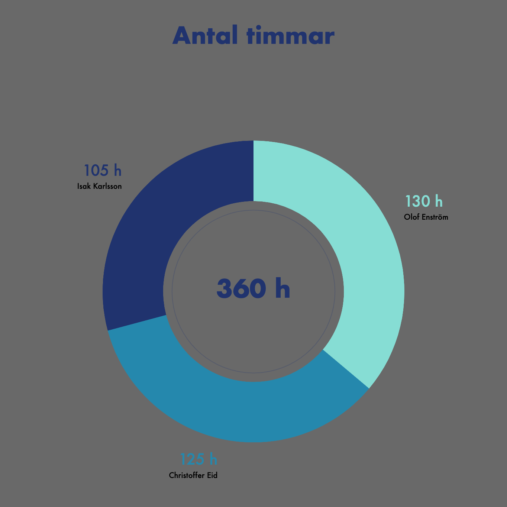

# Gruppmöten
| Datum      | Tid       | Medlemmar               | Gjorde                                   |
|------------|-----------|-------------------------|------------------------------------------|
| 19/11-2020 | 4 timmar  | Christoffer, Isak, Olof | Planering, brainstorming                 |
| 20/11-2020 | 5 timmar  | Christoffer, Isak, Olof | Planering, brainstorming, git-startup    |
| 25/11-2020 | 2 timmar  | Christoffer, Isak, Olof | Skrivit projektplan                      |
| 03/12-2020 | 4 timmar  | Christoffer, Isak, Olof | LoRa-uppkoppling, Rörelsesensor, TIG     |
| 04/12-2020 | 5 timmar  | Christoffer, Isak, Olof | WiFi-sniff, IR/Rörelse-sensor, TIG       |
| 10/12-2020 | 8 timmar  | Christoffer, Isak, Olof | Rörelsesensor, Node-red test             |
| 11/12-2020 | 7 timmar  | Christoffer, Isak, Olof | Rörelsesensor, Node-red                  |
| 14/12-2020 | 8 timmar  | Christoffer, Isak, Olof | PyCom Case, Rörelsesensor, Node-red      |
| 15/12-2020 | 8 timmar  | Christoffer, Isak, Olof | Case, Rörelsesensor, Node-red, uibuilder |
| 18/12-2020 | 4 timmar  | Isak                    | Felsökning, LoRa/deepsleep               |
| 21/12-2020 | 8 timmar  | Christoffer, Isak, Olof | Rörelsesensor, LoRa, server och energieffektivisering |
| 23/12-2020 | 3 timmar  | Christoffer | Rörelsesensor |
| 24/12-2020 | 2 timmar  | Olof | NodeRed |
| 27/12-2020 | 8 timmar  | Christoffer, Olof | Rörelsesensor |
| 28/12-2020 | 6 timmar  | Christoffer, Olof | Rörelsesensor, NodeRed |
| 30/12-2020 | 4 timmar  | Olof | Rörelsesensor |
| 31/12-2020 | 5 timmar  | Christoffer, Olof | Rörelsesensor |
| 02/01-2021 | 4 timmar  | Olof | NodeRed |
| 03/01-2021 | 2/4 timmar  | Christoffer/Olof | Rörelsesensor/NodeRed |
| 06/01-2021 | 7 timmar  | Christoffer, Olof, Isak | Deliverables, redovisningsfilm och NodeRed |
| 07/01-2021 | 8 timmar  | Christoffer, Olof, Isak | Felsök, Testning, Rapport |
| 08/01-2021 | 2 timmar | Isak | Testning |
| 09/01-2021 | 6 timmar | Christoffer, Olof, Isak | Redovisningsfilm |
| 10/01-2021 | 2 timmar | Isak | Rapport |
| 11/01-2021 | 3 timmar | Christoffer | test.md, PyCom-enhet |
| 12/01-2021 | 1 timme | Christoffer | test.md, setup.md |
| 14/01-2021 | 9 timmar | Christoffer, Isak, Olof | Redovisningsfilm, Rapport |
| 15/01-2021 | 8 timmar | Christoffer, Isak, Olof | Rapport, omstrukturering, småfixa allt möjligt |

